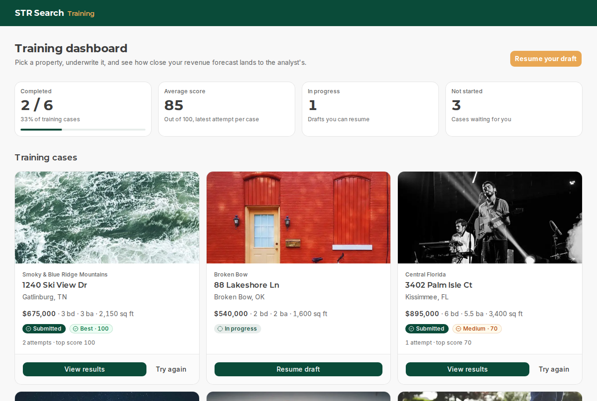
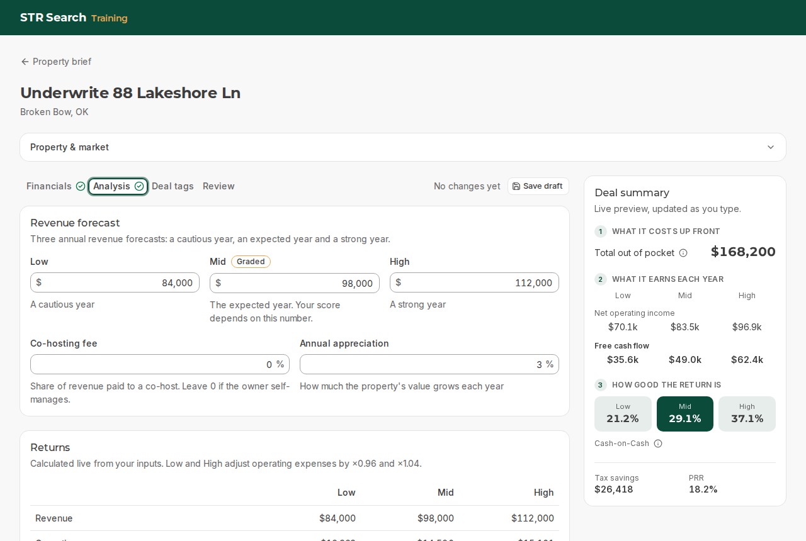
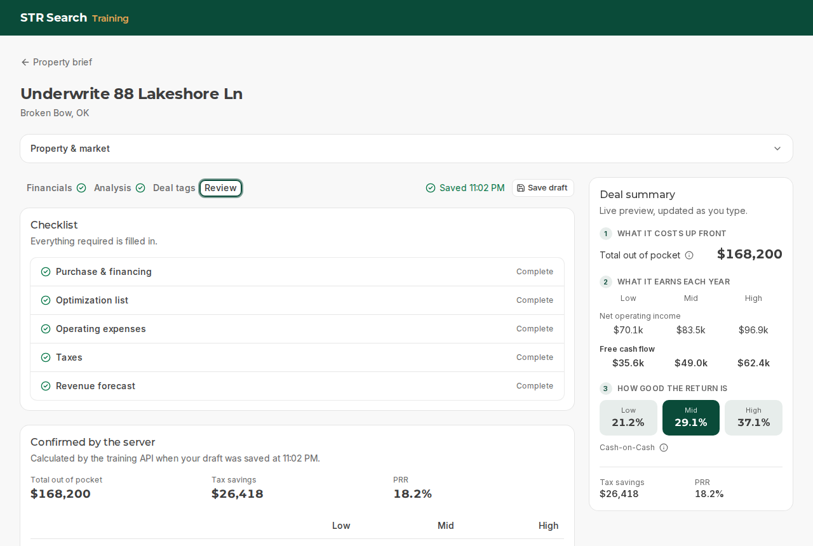
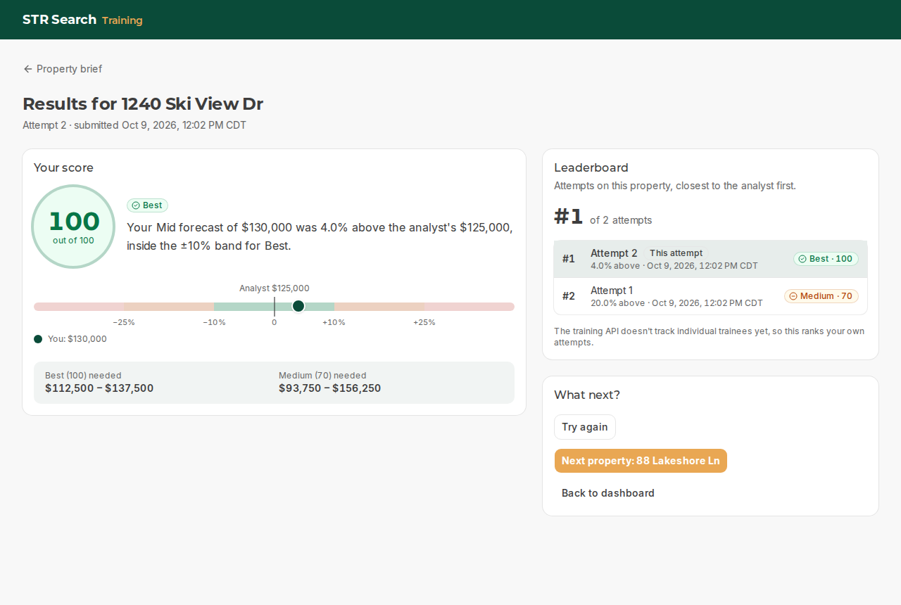
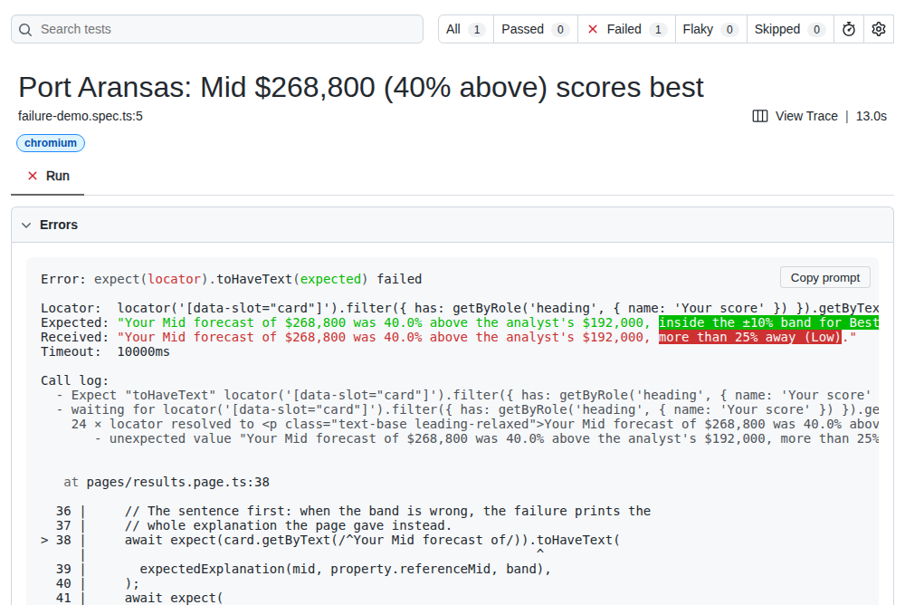

# STR Search: underwriting training

Frontend for the underwriting training platform: a trainee picks a property, underwrites it, submits, and sees how close their revenue forecast landed to the analyst's.

- `frontend/`: Next.js 16 app (this submission)
- `backend/`: FastAPI + Postgres API, provided by STR Search (see [backend/README.md](backend/README.md) for its setup and endpoint contract)



More on the workflow and why the screens are laid out this way: **[frontend/docs/DESIGN.md](frontend/docs/DESIGN.md)**.

## Quick start

You need **Docker** and **Node.js 24** (any version from 22.12 works; `frontend/.nvmrc` pins 24).

```bash
# 1. The API (first start takes a minute or two: build, migrate, seed)
cd backend
docker compose up -d --build
# check: http://localhost:8000/api/dashboard lists six properties (API docs at /docs)

# 2. The frontend
cd ../frontend
nvm use          # or install Node 24 another way
npm ci
npm run dev      # http://localhost:3000
```

For a production build: `npm run build && npm run start`.

If port 8000 or 5434 is already taken, put `API_PORT=8001` and/or `DB_PORT=5435` in `backend/.env` (every `docker compose` command reads it, including the test setup) and point the frontend at the new API port (below).

### Configuration

| Variable       | Default                 | What it is                                                                          |
| -------------- | ----------------------- | ----------------------------------------------------------------------------------- |
| `API_BASE_URL` | `http://localhost:8000` | Where the FastAPI backend runs. Read on the server only, never sent to the browser. |

Copy `frontend/.env.example` to `frontend/.env.local` to change it. The value is validated (it must be an http or https URL), so a typo fails with a clear message instead of a confusing network error.

### Scripts (in `frontend/`)

| Command                   | What it does                                               |
| ------------------------- | ---------------------------------------------------------- |
| `npm run dev`             | Development server on :3000                                |
| `npm run build` / `start` | Production build and server                                |
| `npm run lint`            | ESLint (Next.js rules, React hooks, accessibility)         |
| `npm run typecheck`       | Generates Next.js route types, then TypeScript (no emit)   |
| `npm run format:check`    | Prettier (with Tailwind class sorting)                     |
| `npm run test`            | Unit tests (Vitest)                                        |
| `npm run test:e2e`        | End-to-end tests (Playwright), fully unattended, see below |
| `npm run test:e2e:ui`     | Playwright UI mode, for watching tests step by step        |
| `npm run test:e2e:report` | Opens the HTML report from the last run                    |

To reset the training data at any point: `cd backend && docker compose exec api python -m scripts.seed --reset`.

## Screens

| Workspace (live summary rail)                         | Review before submitting                        |
| ----------------------------------------------------- | ----------------------------------------------- |
|  |  |



## Testing

### Running the suite

```bash
cd frontend
npx playwright install chromium   # first time only: downloads the test browser
npm run test:e2e
```

That one command does everything, with no manual steps:

1. Starts the backend with `docker compose up -d --wait` (it can be stopped beforehand) and waits for `/api/health`.
2. Reseeds the database, so every run starts from the same six untouched properties.
3. Builds the app and serves the production build on port 3100 (your dev server on 3000 is left alone).
4. Runs 48 tests in Chromium, about 2 minutes.

It **resets the training data**, so anything entered by hand is wiped. Options: `SKIP_BACKEND_SETUP=1` skips `docker compose up` when the API is already running; `E2E_PORT` and `E2E_API_URL` change the ports.

Unit tests (`npm run test`, 33 tests, about a second) cover the calculation preview against numbers taken from the API, the API ⇄ form mappers, the review checklist rules and the leaderboard ranking.

### What the end-to-end tests cover

| Spec                     | Tests | What it proves                                                                                                                                                         |
| ------------------------ | ----- | ---------------------------------------------------------------------------------------------------------------------------------------------------------------------- |
| `happy-path.spec.ts`     | 1     | The whole workflow through the UI: dashboard → brief → every field typed in → review → submit → results → dashboard updated                                            |
| `scoring-matrix.spec.ts` | 34    | Grading and its explanation for every property and every band edge (see below)                                                                                         |
| `validation.spec.ts`     | 6     | Incomplete drafts can't be submitted, the checklist jumps to the field, range and Low ≤ Mid ≤ High errors, $0 out of pocket                                            |
| `resilience.spec.ts`     | 6     | Reload keeps the draft, failed save → Retry, failed submit keeps the draft, double-click Start makes one draft, bad ids → 404, the analyst's reference is never served |
| `leaderboard.spec.ts`    | 1     | Ranking by distance from the analyst, ties going to the earlier attempt, the current attempt highlighted                                                               |

### How the scoring cases are generated

The score depends on one number, the Mid revenue forecast, against the analyst's. [`e2e/fixtures/cases.ts`](frontend/e2e/fixtures/cases.ts) generates the cases from each property's reference Mid (taken from the brief's table):

- **One case per band** for all six properties (equivalence partitioning): 104% of the reference (Best), 80% (Medium), 140% (Low). 18 cases.
- **Every band edge** for Gatlinburg ($125,000) and Port Aransas ($192,000) (boundary values): ±10% and ±25% exactly, which must stay in the better band because the limits are inclusive, and $1 past each, which must drop a band. 16 cases.

The edges are computed in integer maths (`reference × 110 / 100`), because `125000 * 1.1` is `137500.00000000001` in floating point, one hair past the boundary it's meant to test.

Each case creates a complete draft through the API (fast and exact), then opens it in the browser, submits through the real confirmation dialog and checks the results page: score, rating, the full explanation sentence and the "Best needed / Medium needed" ranges. The expected text is built in [`e2e/support/expected.ts`](frontend/e2e/support/expected.ts) with its own formatter, so a formatting bug in the app can't make a test pass.

### Keeping it deterministic

- **Real backend, reseeded** rather than mocked: the tests prove the actual grading, not a copy of it.
- **One worker.** Every test shares one database (dashboard counts, leaderboard ranks), so tests run in order instead of racing each other.
- **Listing photos are stubbed** with a 1×1 image, so nothing depends on picsum.photos being up.
- **Failures are injected, not waited for.** Server Actions are `POST`s with a `next-action` header; a `page.route` aborts or fails exactly those to simulate a dropped connection or a 500, while pages keep loading.
- Locators use roles and labels (`getByRole`, `getByLabel`), the way a user or screen reader finds things.

### When a test fails

Trace, screenshot and video are kept for failed tests only. `npm run test:e2e:report` opens the report with the failing step and an expected vs received diff; "View Trace" replays every action with DOM snapshots, network and console. `npx playwright test -g "Dune Walk" --headed` reruns a subset in a visible browser.

A deliberately broken case (40% above the reference, expected to be Best) looks like this. Because the explanation sentence is asserted first, the report says what went wrong without opening anything else:



## Architecture


- **The browser never talks to the API.** Pages read through Server Components; writes go through Server Actions. The API's address, the analyst's reference underwritings and raw error details stay on the server.
- **Zod at both boundaries.** Every API response is parsed (`src/lib/api/schemas.ts`), so decimals that arrive as strings become numbers in one place. Every Server Action re-validates its input, because Server Actions are public endpoints.
- **One place converts units.** The API uses fractions (`0.2`); the form uses whole percentages (`20`). `src/features/workspace/mappers.ts` converts both ways using strings, so `7` never becomes `0.07000000000000001`.
- **Security and performance** have their own sections below.

```
frontend/src/
  app/                  routes (thin): dashboard, properties/[zpid], underwritings/[id], submissions/[id]
  features/
    dashboard/          KPI strip, property cards
    property/           brief, market, attempt history, idempotent Start action
    workspace/          form, sections, schema, mappers, autosave, review, Server Actions
    results/            score and explanation, deviation scale, leaderboard, next steps
  components/ui/        shadcn/ui (Radix) primitives
  components/shared/    app header, number input, badges, stat tiles, formula popover
  lib/api/              server-only API client, schemas, endpoints, errors
  lib/calc/             the underwriting formulas for the live preview
  lib/                  formatting, scoring, leaderboard ranking, routes
frontend/e2e/           Playwright: fixtures, page objects, specs
```

## Security

- **The API is never exposed to the browser.** Pages fetch on the server (Server Components) and every write is a Server Action. `API_BASE_URL` is read on the server only, validated, and never prefixed `NEXT_PUBLIC_`. The modules that call the API are marked `server-only`, so importing them into browser code fails the build.
- **The analyst's answers stay hidden.** The API returns a reference underwriting to anyone who knows its id. The server refuses any underwriting flagged `is_reference` and shows the 404 page instead.
- **Everything is validated twice.** Zod parses every API response. Every Server Action re-validates its input, with size limits (50 rows per list, 80 characters per text field), because Server Actions are public endpoints. Next.js itself rejects Server Action calls from other origins.
- **Rules live on the server, not in the UI.** A submitted attempt can't be saved or submitted again, even though the API would allow it. Start reuses an open draft, so double clicks can't create duplicates.
- **Content-Security-Policy with a fresh nonce on every request** (`src/proxy.ts`): only scripts carrying that response's nonce can run (`'strict-dynamic'`), plus `object-src 'none'`, `base-uri 'self'`, `form-action 'self'` and `frame-ancestors 'none'`.
- **Security headers** (`next.config.ts`): `X-Content-Type-Options: nosniff`, `Referrer-Policy: strict-origin-when-cross-origin`, `X-Frame-Options: DENY`, a `Permissions-Policy` that turns off camera, microphone and geolocation, and no `X-Powered-By`.
- **External content is restricted.** Listing links must be https and open with `noopener noreferrer`. Images load only from the allowed photo host, through Next's image optimizer, with at most one redirect.
- **Failures don't leak details.** Every API call has an 8-second timeout. Users see a plain message; the details go to the server log only.
- **Dependencies:** `npm audit --omit=dev` finds no vulnerabilities in what ships. No `dangerouslySetInnerHTML`, and no `.env` file is committed.

## Performance

- **Less JavaScript in the browser.** Pages are Server Components, so the browser receives ready-made HTML, and component code is sent only for the interactive parts (the workspace form, buttons, dialogs).
- **Data loads in parallel.** The property, workspace and results pages fetch their data with `Promise.all`, and React `cache()` makes repeated calls in one request (the page and its title) share a single fetch.
- **Something shows immediately.** Each route has a loading skeleton that streams in while its data loads.
- **Typing stays fast.** React Hook Form keeps inputs uncontrolled, so a keystroke doesn't re-render the whole form. The summary rail watches the form on its own (`useWatch`) and recalculates with a memoized pure function, in the browser, with no server round trip per keystroke.
- **Few, small requests.** Autosave waits a second after typing stops, sends one request at a time (changes made meanwhile go in one follow-up), and only sends complete sections.
- **Assets are optimized.** Listing photos are resized per screen size with `next/image` (`sizes`), fonts are self-hosted through `next/font` (no request to Google from the browser), and there's no chart library: the deviation scale is plain CSS.

## Decisions and trade-offs

- **Next.js as a backend-for-frontend** instead of calling FastAPI from the browser. It keeps the reference answers and the API off the client and gives one place to enforce rules the API doesn't (below). The cost is a server hop on every request, and Server Actions to learn.
- **Live preview, server truth.** The rail recalculates on every keystroke with the brief's formulas, and the Review tab shows the numbers the API calculated on the last save. The preview rounds exactly like the API (money to cents, percentages to 4 places, half up), and unit tests compare it to API output digit for digit. Before that, a forecast like 98,000 on 540,000 showed PRR 18.1% in the rail and 18.2% from the server.
- **Autosave only sends complete sections.** The API rejects a half-filled section, so the form saves each section once it's valid, and the tabs show which ones are still incomplete. Saves never overlap: changes made during a save are sent together right after it.
- **Tabs plus a summary rail** rather than one long form: the sections follow the brief, and the rail keeps cost → earnings → return in view whichever section you're in. More in [DESIGN.md](frontend/docs/DESIGN.md).
- **Real backend in the e2e suite**, with injected failures, over mocked responses. Slower (about 2 minutes, one worker) but it tests the real grading.
- **Every page renders per request.** The pages show live data anyway, and a nonce-based CSP needs it (a prerendered page has no nonce). Nothing is cached at a CDN.

## Assumptions

- **One trainee.** The API has no users, so the leaderboard ranks attempts on a property (closest to the analyst first, earlier first on a tie) and says so on the page.
- **A submitted attempt is final.** The API would accept edits after submitting; the frontend refuses them and opens the results instead. "Try again" starts a new draft.
- **Start is idempotent.** `POST /api/underwritings` always creates a new draft, so Start reuses the property's open draft if there is one.
- **The analyst's reference underwritings are never shown before grading.** They're readable by id from the API; the frontend refuses any underwriting flagged `is_reference`.
- **Dates rendered on the server use US Central time** and say so ("CDT"), so server and browser render the same text.

## Limitations and next steps

- **No authentication.** With users, the leaderboard would rank trainees by their best attempt, and "final after submit" would be enforced by the API instead of the frontend.
- **Last write wins** when the same draft is open in two tabs. A version number on save (optimistic concurrency) would catch it.
- **JavaScript is required.** Pages stream behind loading skeletons, and the workspace is an interactive form.
- **The API allows any origin (CORS `*`) and serves references by id.** The frontend doesn't depend on either, but both should be locked down in the API itself.
- **The amber buttons use white text** to match strsearch.com. That's 2.1:1 contrast, below the 4.5:1 WCAG AA asks for, so the text is bold. If accessibility should win, setting `--cta-foreground` to `#1F1F1F` in `globals.css` (7.9:1) is a one-line change.
- **The e2e suite runs serially** because it shares one database. A database per worker, or per-trainee data once there are users, would allow parallel runs.
- **`npm audit`** reports nothing for production dependencies. Dev tooling (the shadcn CLI and ESLint) pulls in a `braces` advisory with no patched release; it only affects glob patterns on a developer's machine.

## Stack

Next.js 16 (App Router, Turbopack) · React 19 · TypeScript · Tailwind CSS 4 · shadcn/ui on Radix · React Hook Form + Zod 4 · Vitest · Playwright · Node 24.
